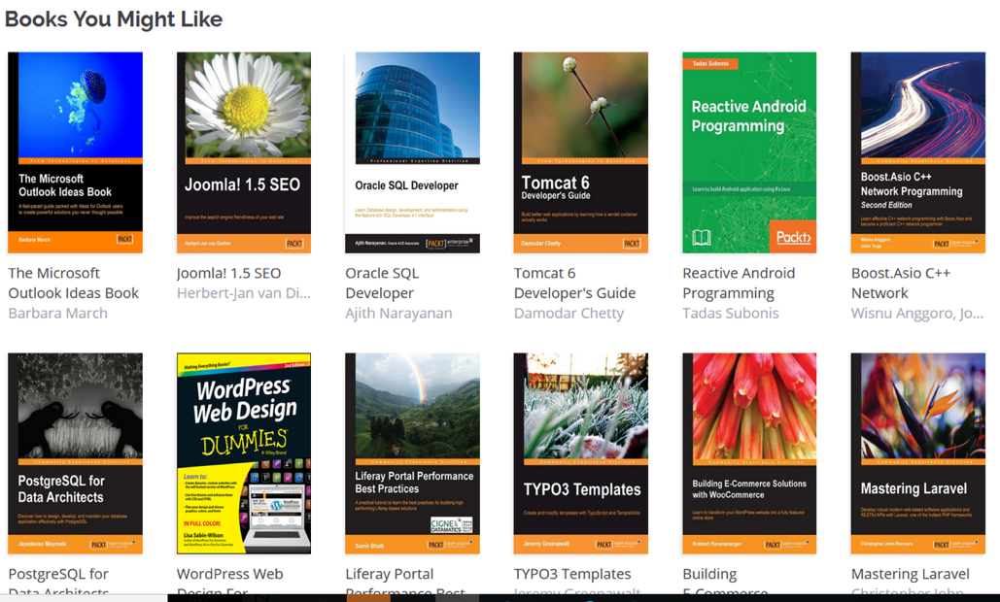
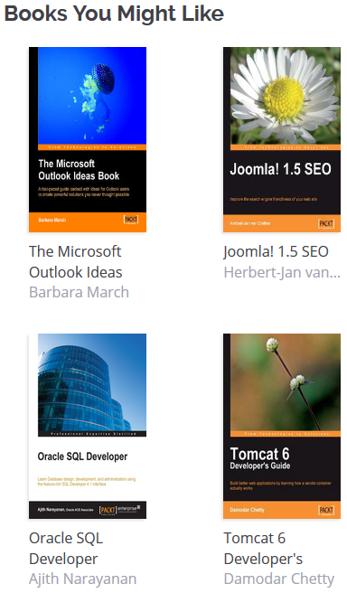

# Perlego take-home assignment

Hello and welcome to the domain specific Perlego developer assessment. Congratulations on
passing the initial interview; now we are going to test your skills through a realistic
challenge that you could experience on the job. The role you're applying for, will require you
to have an understanding of javascript/typescript across the stack and knowledge of React,
Node and appropriate test libraries. We would like to see the use of these in the below.

## The Task

For the assignment, we would like you to create a “Books You Might Like” grid component. You can
see what these look like by looking at the images below.

**Desktop view**


**Mobile view**


### Front End Requirements:

1. The grid component must consist of a number of React components and utilise appropriate
   state management.
2. The grid component must retrieve the book data using an appropriate mechanism.
3. The grid component must be fully responsive.

### Back End Requirements:

1. A Node.js API must be setup to return the data from the back end to the front end.
2. The API must interact with the Perlego dataset provided in order to return the relevant books.
3. You can choose whether to use an ORM or SQL to interact with the database from within the API.

### Book Covers

To get a cover file, you can apply the following logic:

```
Coverfile = "https://www.perlego.com" + Location + Coverfile Name
```

Where location and Coverfile are located in the database.

## We Made A Humble Beginning

We have already made a very simple react frontend and express backend, and tied it together with
a mysql database and docker setup for you. You can choose to reuse it, or throw it all away and
start over however you'd like.

If you decide to use the existing docker setup, you must execute

```
docker-compose build
```

the first time you want to use it, and every time you're changing something to the package.json
files.

You can use

```
docker-compose up
```

to start the whole setup, and ctrl+c to stop it.

Once started, the frontend is available on port 8000 (`http://localhost:8000`), the backend is
available on port 8001, and the database is available on port 8002 should you want to point
any database management app to it.

The url the backend is available on for the frontend should be `http://localhost:8001`.
The database properties that can be used in the backend are as follows:

```
- host: database
- user: perlego
- password: perlego
- database: perlego
```

## Scoring

In order to score the score the assessment, we will review the code with our development team and
also review the results of an automated analysis.

- Secure solutions will score more highly than non-secure versions.
- Solutions using common design patterns and cleaner solutions will score more highly.
- Creative & over-engineered solutions demonstrating your breadth of skills will score more
  highly and allow us to understand the breadth and depth of your skills.
- Assessments without automated tests will not pass.
  When working through the assessment, think “What can I do to make my work stand out?”. As opposed
  to what is just enough to meet the requirements. We are looking to evaluate the breadth and depth
  of your skillset with this exercise, not the volume of code you can produce.

## Handing In

Please copy the contents of this repository into your own private GitHub repository and add `ebper` to the project.
It is important that you do not commit your solution to this repository as it could expose your coding challenge to other candidates.

We will provide feedback via email or the final interview depending on whether you
pass.

## Help & Questions

If there is anything in the assessment that you do not understand or would like clarification on
feel free to contact ellie@perlego.com, she will usually get back to you within a couple of hours.

**Good luck!**
